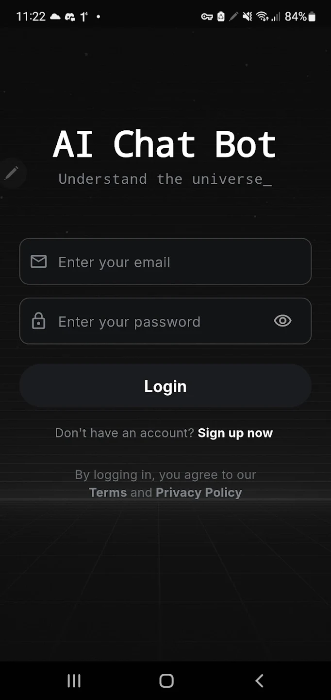

<a name="readme-top"></a>

<!-- PROJECT LOGO -->
<br />
<div align="center">
  <a href="assets/images/icon.svg" target="_blank" rel="noopener noreferrer">
    
  </a>

  <h3 align="center">AI-Powered Chat Platform</h3>

  <p align="center">
    A Flutter-based multi-platform for interactive AI chat, bot creation, and knowledge management with monetization features.
    <br />
    <a href="https://www.youtube.com/watch?v=lBHZlj41hyA" target="_blank" rel="noopener noreferrer"><strong>Watch Demo »</strong></a>
    <br />
    <br />
    <a href="https://docs.google.com/forms/d/1oUM87A2Kkv7ME9OhRtNDZ_HyMsoKzJR_lOCwna4T_rU/viewform?edit_requested=true" target="_blank" rel="noopener noreferrer">Report Bug</a>
    ·
    <a href="https://docs.google.com/forms/d/1Buxc42n_T9O5ELi6t2nj0SGoZE1yg675G625TSSLJcA/viewform?pli=1&pli=1&edit_requested=true" target="_blank" rel="noopener noreferrer">Request Feature</a>
  </p>
</div>

<!-- TABLE OF CONTENTS -->
<details>
  <summary>Table of Contents</summary>
  <ol>
    <li>
      <a href="#about-the-project">About The Project</a>
      <ul>
        <li><a href="#key-features">Key Features</a></li>
        <li><a href="#built-with">Built With</a></li>
      </ul>
    </li>
    <li>
      <a href="#getting-started">Getting Started</a>
      <ul>
        <li><a href="#prerequisites">Prerequisites</a></li>
        <li><a href="#environment-setup">Environment Setup</a></li>
        <li><a href="#running-the-application">Running the Application</a></li>
      </ul>
    </li>
    <li>
      <a href="#project-directory-structure">Project Directory Structure</a>
    </li>
    <li><a href="#contact">Contact</a></li>
  </ol>
</details>

<!-- ABOUT THE PROJECT -->

## About The Project

<div align="center">
  
</div>

**AI-Powered Chat Platform** is a Flutter-based multi-platform designed to provide users with an interactive AI chat experience, customizable AI bot creation, and knowledge dataset management. This platform emphasizes secure authentication, intuitive UI/UX, and monetization through in-app purchases (IAP) and ads. It integrates AI-driven features like email drafting and prompt management to enhance user productivity and engagement.

### Key Features:
- **Secure Authentication**: User registration, login, and logout with validation for usernames and passwords.
- **AI Chat System**: Interactive chat with AI bots, thread creation, history tracking, and token-based usage.
- **AI Bot Management**: Create, update, delete, and customize AI bots with tailored prompts and knowledge datasets.
- **Knowledge Datasets**: Upload and manage datasets from files or URLs, with options to disable or delete sources.
- **Prompt Library**: Create, search, and manage public/private prompts, with categorization and quick-access via slash commands.
- **Monetization**: Upgrade to Pro accounts with unlimited tokens, in-app purchases, and ad integration for revenue.
AI Email Drafting: Dedicated tab for composing emails with AI-driven actions (e.g., Thanks, Sorry, Follow Up).
- **Responsive Design**: User-friendly interface with support for dark mode and seamless navigation.

<p align="right">(<a href="#readme-top">back to top</a>)</p>

### Built With

This platform is built with modern Flutter/Dart technologies:

- [![Flutter][Flutter.js]][Flutter-url]
- [![Dart][Dart.js]][Dart-url]
- [![Firebase][Firebase.js]][Firebase-url]
- [![Google Cloud][GoogleCloud.js]][GoogleCloud-url]
- [![Gemini AI][Gemini.js]][Gemini-url]

<p align="right">(<a href="#readme-top">back to top</a>)</p>

## Getting Started

### Prerequisites

- Flutter SDK 3.29.1 or higher
- Firebase project
- Google Cloud project with OAuth credentials
- Gemini API key

### Environment Setup

1. Copy `.env.example` to `.env` and fill in your API keys:

```bash
GEMINI_API_KEY=your_gemini_api_key_here
GOOGLE_DESKTOP_CLIENT_ID=your_desktop_client_id_here
GOOGLE_CLIENT_SECRET=your_client_secret_here
```

2. Run `flutter pub get` to install dependencies

### Running the Application

```bash
# For Windows
flutter run -d windows

# For Web
flutter run -d chrome

# For Android
flutter run -d android
```

## Project Directory Structure

- `lib/`: Flutter application code
  - `core/`: Core functionality and models
  - `features/`: Feature-specific code
  - `widgets/`: Reusable UI components

- `functions/`: Firebase Cloud Functions
  - TypeScript backend code

- `windows/`: Windows-specific platform code

## Contact

Ngo Cao Anh Thinh - anhthinhncat@gmail.com

Google Play: [AI Chat Bot](https://play.google.com/store/apps/details?id=com.aichatbot.assistant&hl=en&pli=1)

<p align="right">(<a href="#readme-top">back to top</a>)</p>

<!-- MARKDOWN LINKS & IMAGES -->
[Flutter.js]: https://img.shields.io/badge/Flutter-02569B?style=for-the-badge&logo=flutter&logoColor=white
[Flutter-url]: https://flutter.dev/
[Dart.js]: https://img.shields.io/badge/Dart-0175C2?style=for-the-badge&logo=dart&logoColor=white
[Dart-url]: https://dart.dev/
[Firebase.js]: https://img.shields.io/badge/Firebase-FFCA28?style=for-the-badge&logo=firebase&logoColor=black
[Firebase-url]: https://firebase.google.com/
[GoogleCloud.js]: https://img.shields.io/badge/Google_Cloud-4285F4?style=for-the-badge&logo=google-cloud&logoColor=white
[GoogleCloud-url]: https://cloud.google.com/
[Gemini.js]: https://img.shields.io/badge/Gemini_AI-8E75B2?style=for-the-badge&logo=google&logoColor=white
[Gemini-url]: https://cloud.google.com/vertex-ai/docs/generative-ai/model-reference/gemini
[Hive.js]: https://img.shields.io/badge/Hive-FF7043?style=for-the-badge&logo=hive&logoColor=white
[Hive-url]: https://docs.hivedb.dev/
[Provider.js]: https://img.shields.io/badge/Provider-4CAF50?style=for-the-badge&logo=flutter&logoColor=white
[Provider-url]: https://pub.dev/packages/provider